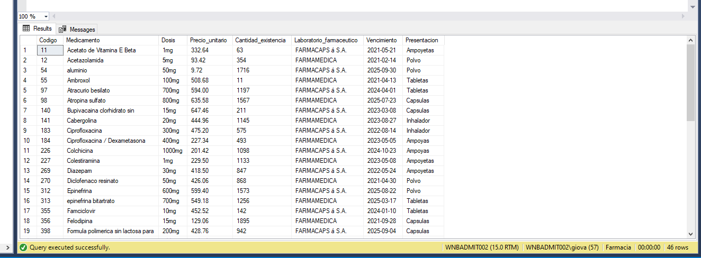

# App Fullstack para la farmacia de Universidad Mariano Galvez de Guatemala
Web Service en JAVA, con clientes JAVA y .NET Frameworks

# API
El sistema backend fue creado con la tecnologia JAVA EE 8, JDK 1.8 actualizacion 221.
## El sistema es capaz de:
* Adquirir los medicamentos de la base de datos(segun requerimiento de los clientes)
* Realizar actualizacion de inventario en caso de compra de medicamentos
* Insercion de inventario por medio de archivo .CSV
* Generacion de factura

# Cliente Java
El cliente JAVA fue creado con la tecnologia JAVA EE 8, con funciones de Servlets, Java Server Pages.
## Cuenta con las funciones de:
* Interfaz web 
* Muestra de medicamentos
* Busqueda de medicamentos por codigo
* Busqueda de medicamentos por nombre
* Busqueda de medicamentos por laboratorio farmaceutico
* Venta de medicamentos
* Generacion de factura

# Cliente .NET Frameworks
El cliente .NET Frameworks fue creado con la tecnologia .Net Frameworks 4.8.
## Cuenta con las funciones de:
* Interfaz web 
* Muestra de medicamentos
* Busqueda de medicamentos por codigo
* Busqueda de medicamentos por nombre
* Busqueda de medicamentos por laboratorio farmaceutico
* Venta de medicamentos

# Base de datos
La base de datos, incluye unicamente una tabla de medicamentos, sobre la cual se aplicaron procedimientos almacenados, para facilitar la ejecucion de consultas desde el servicio web.

